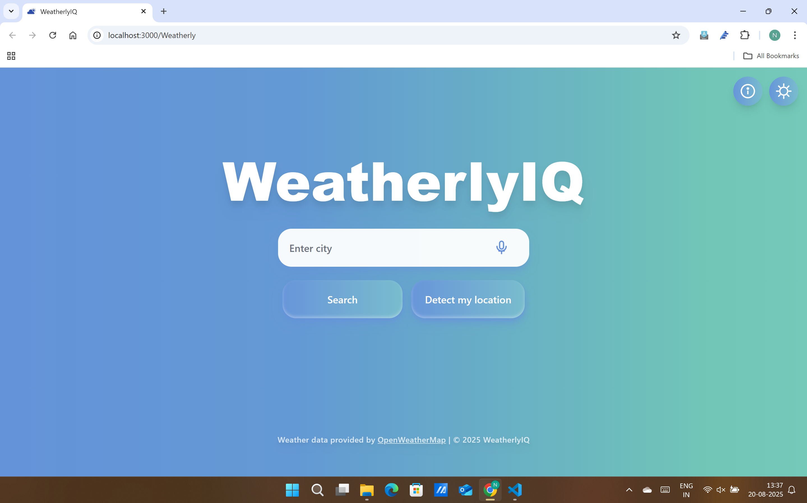
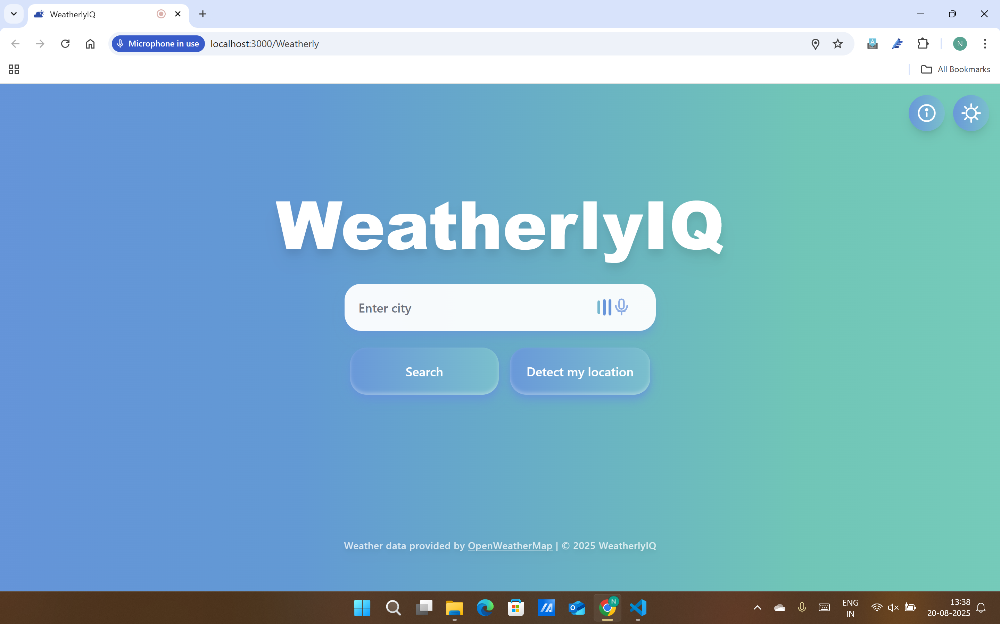
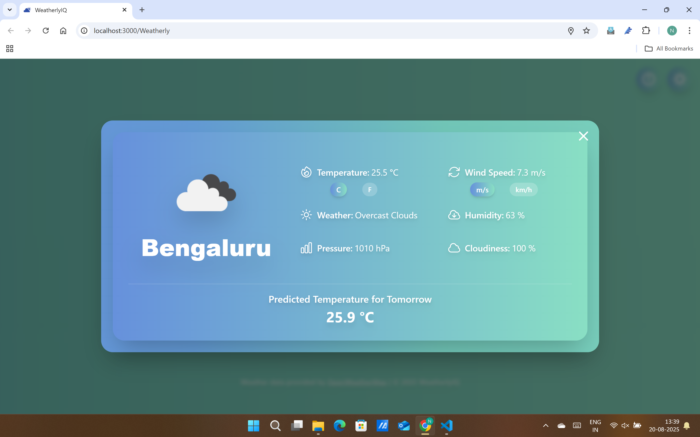
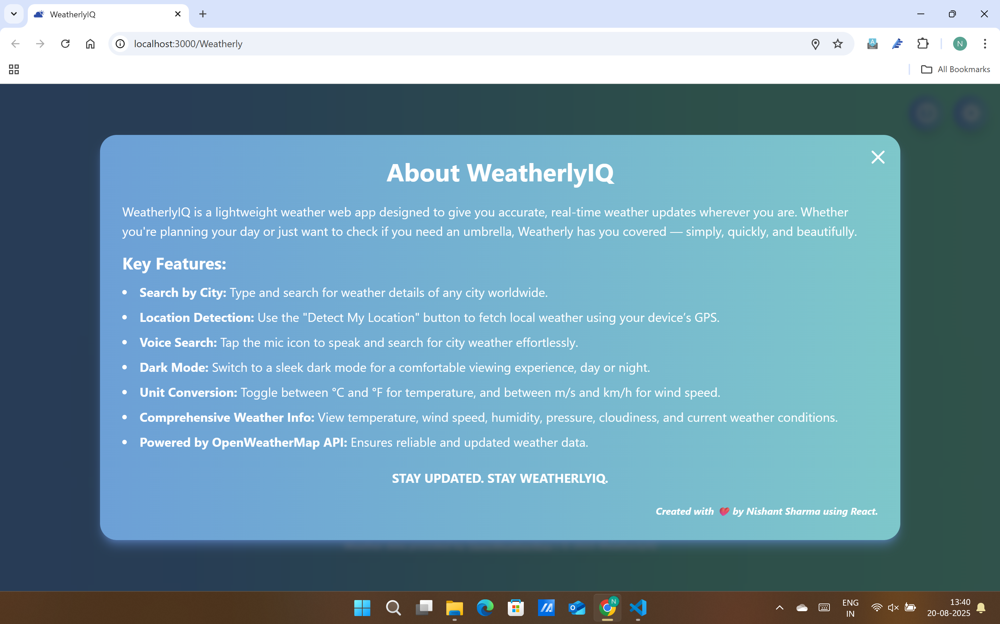
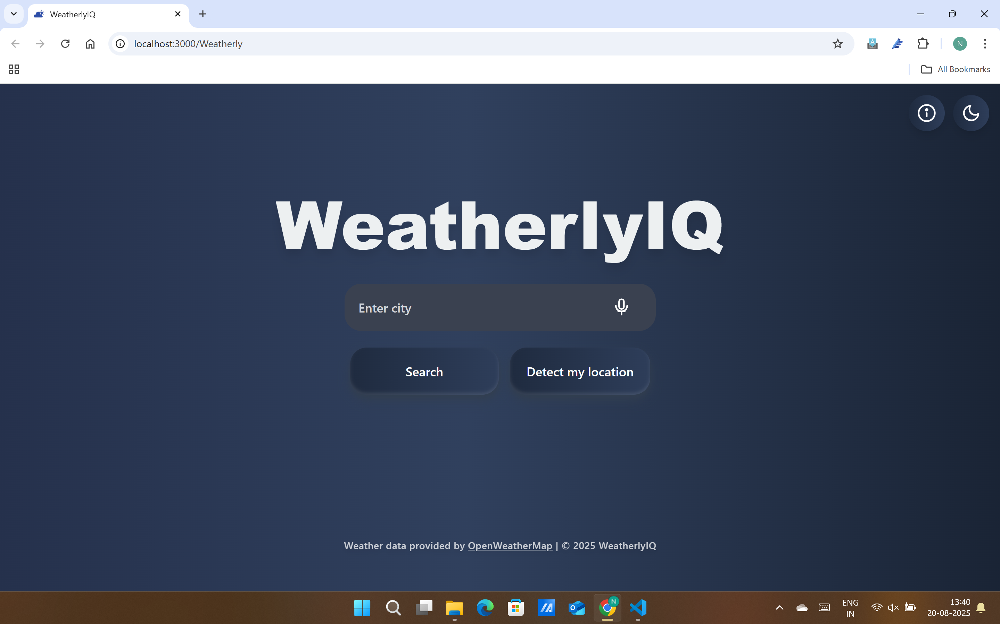
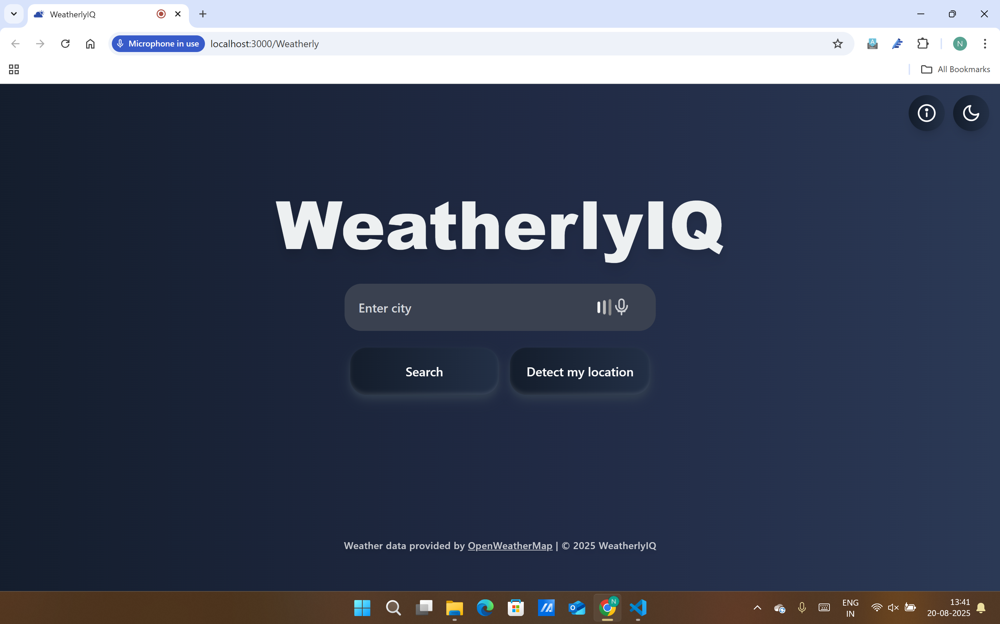
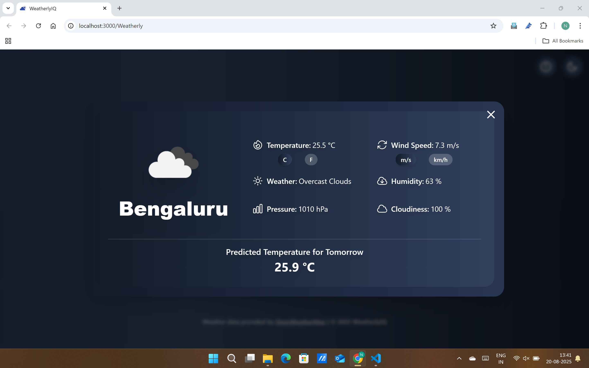
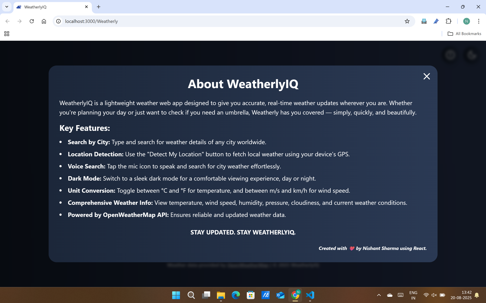

# WeatherlyIQ - A Weather App

WeatherlyIQ is a modern, responsive weather application built with React and Tailwind CSS. It provides real-time weather information for any city worldwide, with support for voice input and geolocation detection. The app features machine learning capabilities including next-day temperature prediction using Linear Regression models trained with scikit-learn. It includes a sleek dark mode, smooth animations, gradient colors with moving background effects, and an intuitive user interface inspired by contemporary weather apps.

## Project Screenshots

### Light Mode






### Dark Mode






## Features

- **City Weather Search:** Enter any city name to get current weather data.
- **Voice Input:** Use the Web Speech API's SpeechRecognition interface to input city names by voice.
- **Geolocation Detection:** Automatically detect your location and show local weather.
- **Temperature Units:** Toggle between Celsius and Fahrenheit.
- **Wind Speed Units:** Toggle between meters per second (m/s) and kilometers per hour (km/h).
- **Dark Mode:** Switch between light and dark themes for comfortable viewing.
- **Animated UI:** Smooth background gradients, fade-ins, moving gradient animations, and interactive elements.
- **Error Handling:** User-friendly error messages for invalid input or API issues.
- **Next-Day Temperature Prediction:** Machine learning feature that predicts tomorrow's temperature using Linear Regression model trained with scikit-learn. The model analyzes historical weather patterns to provide accurate temperature forecasts for maximum and minimum temperatures.

## Technology Stack

- **React:** Frontend UI library for building interactive user interfaces.
- **Tailwind CSS:** Utility-first CSS framework for styling and responsive design.
- **Axios:** HTTP client for API requests to OpenWeatherMap.
- **OpenWeatherMap API:** Provides real-time weather data.
- **Web Speech API (SpeechRecognition):** Browser API for voice input.
- **Heroicons:** SVG icon set used for UI icons.
- **JavaScript (ES6+):** Modern JavaScript features and React hooks.
- **Python Flask:** Backend API framework for handling machine learning predictions.
- **Scikit-learn:** Machine learning library for Linear Regression model training and predictions.
- **Pandas:** Data manipulation and analysis for weather data processing.
- **Pickle:** Python module for serializing and saving trained machine learning models.

## Project Structure

```
weatherlyIQ/
├── README.md
├── .gitignore
├── backend/
│   ├── .gitignore
│   ├── app.py                 # Flask backend server
│   ├── weather_data.csv       # Training data for ML models
│   ├── weather_model_max.pkl  # Trained model for max temperature prediction
│   └── weather_model_min.pkl  # Trained model for min temperature prediction
├── frontend/
│   ├── .gitignore
│   ├── package.json
│   ├── package-lock.json
│   ├── tailwind.config.js
│   ├── postcss.config.js
│   ├── README.md
│   ├── public/
│   │   ├── index.html
│   │   ├── weatherlyFavicon.png
│   │   ├── homeLight1.png
│   │   ├── homeLight2.png
│   │   ├── homeDark1.png
│   │   ├── homeDark2.png
│   │   ├── resultLight.png
│   │   ├── resultDark.png
│   │   ├── aboutLight.png
│   │   └── aboutDark.png
│   └── src/
│       ├── index.js
│       ├── index.css
│       ├── App.js
│       ├── components/
│       │   ├── About.js
│       │   ├── AboutIcon.js
│       │   ├── DarkModeToggle.js
│       │   ├── ErrorMessage.js
│       │   ├── Footer.js
│       │   ├── SearchBar.js
│       │   └── WeatherCard.js
│       └── styles/
│           └── animations.css
├── build/                     # Production build directory
└── public/                    # Shared public assets
```

## Setup and Installation

### Prerequisites
- Node.js (v14 or higher)
- Python (v3.7 or higher)
- npm or yarn package manager

### Backend Setup (Flask API)

1. Navigate to the backend directory:
   ```bash
   cd backend
   ```

2. Create a virtual environment (recommended):
   ```bash
   python -m venv venv
   # On Windows:
   venv\Scripts\activate
   # On macOS/Linux:
   source venv/bin/activate
   ```

3. Install Python dependencies:
   ```bash
   pip install flask flask-cors pandas scikit-learn
   ```

4. Run the Flask backend server:
   ```bash
   python app.py
   ```
   
   The backend server will start on `http://localhost:5000`

### Frontend Setup (React App)

1. Navigate to the frontend directory:
   ```bash
   cd frontend
   ```

2. Install dependencies:
   ```bash
   npm install
   ```

3. Create a `.env` file in the frontend root directory and add your OpenWeatherMap API key:
   ```bash
   REACT_APP_WEATHER_API_KEY=your_api_key_here
   ```

4. Start the development server:
   ```bash
   npm start
   ```

5. Open your browser and visit `http://localhost:3000` to use the app.

### Running Both Backend and Frontend Together

#### Option 1: Separate Terminal Windows
1. **Terminal 1** - Backend:
   ```bash
   cd backend
   python app.py
   ```

2. **Terminal 2** - Frontend:
   ```bash
   cd frontend
   npm start
   ```

#### Option 2: Using Concurrently (Optional)
If you want to run both from a single command, you can install `concurrently`:

1. Install concurrently globally:
   ```bash
   npm install -g concurrently
   ```

2. Create a root-level package.json with scripts:
   ```json
   {
     "scripts": {
       "dev": "concurrently \"cd backend && python app.py\" \"cd frontend && npm start\""
     }
   }
   ```

3. Run both with:
   ```bash
   npm run dev
   ```

## Environment Variables

### Backend (.env file in backend/)
- `FLASK_ENV=development`
- `FLASK_DEBUG=1`
- `PORT=5000`

### Frontend (.env file in frontend/)
- `REACT_APP_WEATHER_API_KEY=your_openweathermap_api_key`
- `REACT_APP_BACKEND_URL=http://localhost:5000`

## Usage

1. **Start the backend server** (Flask API) first
2. **Start the frontend server** (React app)
3. **Access the application** at `http://localhost:3000`
4. **Enter a city name** in the search bar or use the microphone button to speak the city name
5. **Click "Search"** to fetch weather data
6. **Use the "Detect my location"** button to get weather for your current location
7. **Toggle temperature and wind speed units** using the buttons on the weather card
8. **Switch between light and dark mode** using the toggle button
9. **View next-day temperature predictions** powered by machine learning models
10. **Click the info icon** to learn more about the app

## API Endpoints

### Backend API (Flask)
- `GET /` - Health check endpoint
- `GET /predict` - Get next-day temperature predictions
- `POST /weather` - Get current weather data (if implemented)

### Frontend API Calls
- OpenWeatherMap API for current weather data
- Backend API for ML predictions

## Troubleshooting

### Common Issues

1. **Port already in use**: 
   - Change the port in backend/app.py or frontend/package.json

2. **CORS errors**: 
   - Ensure Flask-CORS is installed and configured in backend/app.py

3. **API key issues**: 
   - Verify your OpenWeatherMap API key is valid and properly set in .env

4. **Python module not found**: 
   - Install missing dependencies: `pip install -r requirements.txt`

## Contact

**Credits:** Nishant Sharma  
For any questions or support, please contact at sharmanishant731@gmail.com
